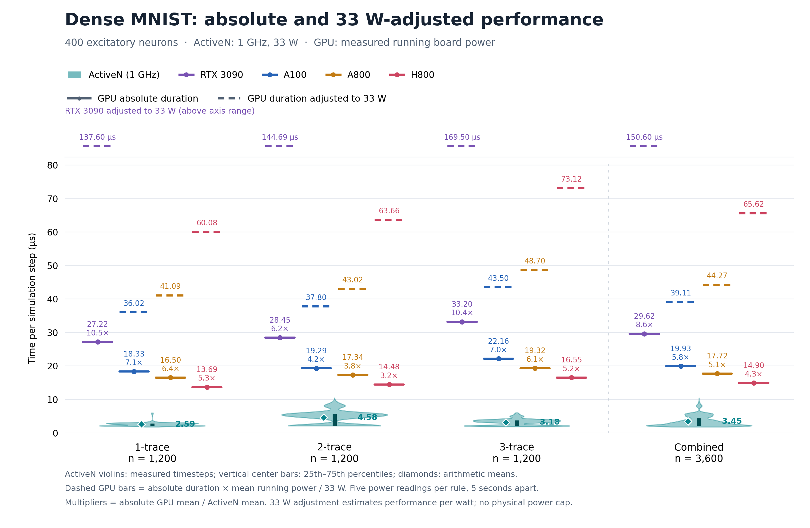

# Dense MNIST: absolute and 33 W-adjusted performance

Solid GPU bars show measured duration; dashed bars show duration adjusted to 33 W, using timing and running power from the same run. ActiveN violins include vertical 25th–75th percentile bars and arithmetic-mean diamonds. RTX 3090's adjusted markers sit in a labeled strip above the axis and do not set its range; their labels retain the actual durations. Each absolute-point multiplier is the measured GPU mean / ActiveN mean for its group, distinct from the mean sample energy advantage reported below.

Measured running board power: exactly five readings per GPU/rule, five seconds apart. Each case has one ~25-second timed training run after 10 seconds of warmup. Checkpoint writing and per-timestep GeNN event timing were disabled.

| GPU | Rule | Five readings (W) | Mean (W) | Measured µs/step | Estimated µJ/step | Equivalent µs at 33 W |
| --- | --- | --- | ---: | ---: | ---: | ---: |
| RTX 3090 | 1-trace | 166.64, 166.79, 166.77, 166.89, 167.08 | 166.834 | 27.218 | 4540.85 | 137.602 |
| RTX 3090 | 2-trace | 167.58, 167.84, 167.79, 168.24, 167.80 | 167.850 | 28.446 | 4774.68 | 144.687 |
| RTX 3090 | 3-trace | 168.46, 168.46, 168.38, 168.43, 168.61 | 168.468 | 33.203 | 5593.61 | 169.503 |
| A100 | 1-trace | 64.98, 65.39, 65.01, 64.08, 64.77 | 64.846 | 18.332 | 1188.76 | 36.023 |
| A100 | 2-trace | 64.78, 67.14, 64.00, 63.73, 63.77 | 64.684 | 19.286 | 1247.52 | 37.804 |
| A100 | 3-trace | 66.56, 64.10, 64.68, 63.72, 64.89 | 64.790 | 22.157 | 1435.54 | 43.501 |
| A800 | 1-trace | 82.62, 82.12, 81.52, 82.12, 82.62 | 82.200 | 16.497 | 1356.05 | 41.093 |
| A800 | 2-trace | 81.52, 80.59, 81.11, 82.95, 83.22 | 81.878 | 17.338 | 1419.60 | 43.018 |
| A800 | 3-trace | 83.55, 83.22, 82.36, 83.22, 83.55 | 83.180 | 19.322 | 1607.23 | 48.704 |
| H800 | 1-trace | 144.64, 144.67, 144.93, 144.93, 145.09 | 144.852 | 13.686 | 1982.51 | 60.076 |
| H800 | 2-trace | 145.04, 145.20, 145.10, 145.18, 145.15 | 145.134 | 14.475 | 2100.85 | 63.662 |
| H800 | 3-trace | 145.68, 145.80, 145.91, 145.88, 145.89 | 145.832 | 16.545 | 2412.83 | 73.116 |

ActiveN advantage after power normalization, using the confirmed arithmetic mean of sample ratios:

| GPU | 1-trace | 2-trace | 3-trace | Combined |
| --- | ---: | ---: | ---: | ---: |
| RTX 3090 | 54.938× | 39.610× | 58.131× | 50.893× |
| A100 | 14.382× | 10.349× | 14.919× | 13.217× |
| A800 | 16.406× | 11.777× | 16.703× | 14.962× |
| H800 | 23.986× | 17.428× | 25.075× | 22.163× |
| All GPUs | 27.428× | 19.791× | 28.707× | 25.309× |

Combined values (rules and hardware samples equally weighted):

| GPU | Estimated mean µJ/step | Equivalent mean µs at 33 W | Ratio of mean energies | Historical timings × new power: mean sample advantage |
| --- | ---: | ---: | ---: | ---: |
| RTX 3090 | 4969.71 | 150.597 | 43.666× | 49.573× |
| A100 | 1290.61 | 39.109 | 11.340× | 13.333× |
| A800 | 1460.96 | 44.272 | 12.837× | 15.339× |
| H800 | 2165.39 | 65.618 | 19.026× | 22.843× |

All-GPU mean sample energy advantage: **25.309×**. Ratio of overall mean energies: **21.717×**.

ActiveN mean energy at the supplied 33 W is **113.813 µJ/step** (1-trace: 85.332; 2-trace: 151.123; 3-trace: 104.984 µJ/step).

Energy per step is estimated as mean sampled watts × measured microseconds per step. The 33 W equivalent duration is that energy divided by 33. The primary advantage averages this equivalent duration / each hardware sample duration, keeping the measured 70:30 presentation/rest mixture. Each of the five power readings receives equal weight. Combined energy averages each rule's power × time; it does not multiply pooled power and pooled time.

Fresh timing and power were collected together. These runs continue past a 10-second warmup, so their image ranges differ from the historical 100-image GPU timing runs. Every new run first reproduced the historical first-100-image attempts and spike counters. The historical-timing projection is listed separately and combines older timing with new measured power.

Five sensor snapshots give a coarse running-power estimate, not a continuous energy integral. Ranges and raw samples are retained; no confidence interval is inferred from five correlated readings. NVIDIA reports board power, which excludes the host CPU. Idle board overhead is included. ActiveN's 33 W is the user-supplied design figure, not a new power measurement. This comparison neither uses TDP nor predicts actual GPU latency under a 33 W cap.

Sensor semantics: [NVIDIA nvidia-smi documentation](https://docs.nvidia.com/deploy/nvidia-smi/index.html#gpu-power-readings). Depending on GPU/driver, `power.draw` is an instantaneous or averaged board-power reading.

[Raw power CSV](power_samples.csv) · [Comparison CSV](comparison.csv) · [Summary JSON](summary.json) · [Run manifests](manifest.json) · [SVG plot](mnist_dense_33w.svg)
