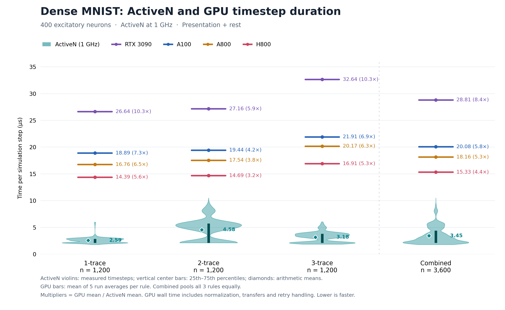

# Dense MNIST ActiveN comparison

ActiveN violins include vertical 25th–75th percentile bars and arithmetic-mean diamonds; GPU bars show mean durations. Each plotted multiplier is the GPU mean duration divided by the ActiveN mean for that group (the ratio of means, distinct from the mean of individual speedup ratios below).

Mean of individual speedup ratios, with each hardware sample and each GPU repetition equally weighted within its rule:

| GPU | 1-trace | 2-trace | 3-trace | Combined |
| --- | ---: | ---: | ---: | ---: |
| RTX 3090 | 10.635× | 7.434× | 11.193× | 9.754× |
| A100 | 7.541× | 5.321× | 7.513× | 6.792× |
| A800 | 6.690× | 4.803× | 6.917× | 6.137× |
| H800 | 5.745× | 4.020× | 5.799× | 5.188× |
| All GPUs | 7.653× | 5.395× | 7.856× | 6.968× |

Arithmetic mean timestep durations:

| Device | 1-trace (µs) | 2-trace (µs) | 3-trace (µs) | Combined (µs) |
| --- | ---: | ---: | ---: | ---: |
| ActiveN | 2.586 | 4.579 | 3.181 | 3.449 |
| RTX 3090 | 26.637 | 27.156 | 32.636 | 28.810 |
| A100 | 18.887 | 19.438 | 21.907 | 20.077 |
| A800 | 16.757 | 17.545 | 20.171 | 18.157 |
| H800 | 14.390 | 14.686 | 16.911 | 15.329 |

Combined ratios of mean durations (a separate statistic):

| GPU | Mean GPU duration / mean ActiveN duration |
| --- | ---: |
| RTX 3090 | 8.353× |
| A100 | 5.821× |
| A800 | 5.265× |
| H800 | 4.445× |
| All GPUs | 5.971× |

GPU durations include normalization, transfers, retry handling, presentation and rest. ActiveN durations are the supplied cycles at 1 GHz. These records do not establish identical hardware/GPU timing boundaries or paired spike trajectories.

See [README](README.md) for formulas, schema, protocol, and reproduction commands; [manifest.json](manifest.json) identifies source artifacts and software.
