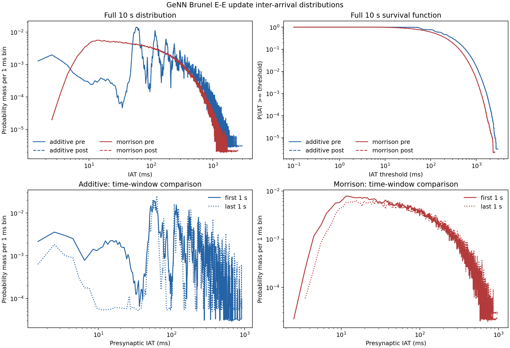

# Synapse-update locality results

## Current GeNN Brunel result

The current source of record is the FP32 GeNN default: 9,000 E and 2,250 I
neurons, fixed indegrees 450 E and 112 I, 4,050,000 plastic E-to-E synapses,
zero GeNN delay steps, arrival-timed STDP, and recurrent delivery scale
`sqrt(20)`. External input is scaled by 0.47 for additive STDP and 0.32 for
Morrison STDP. Both cases use seed and state seed `20260724`, 100 ms of
presimulation, and a 0.1 ms timestep.

### Current conclusion

The sparse, zero-delay network has weak spatial concentration at individual
neuron and edge granularity, but the two rules have substantially different
temporal locality.

- Every E and I neuron fired in each 10-second capture. E-neuron firing-count
  Gini is 0.0825 for additive and 0.0774 for Morrison; the busiest 10% account
  for only 12.68% and 12.47% of E spikes. Whole-graph edge-update Gini is still
  lower at 0.0587 and 0.0550.
- Endpoint firing counts explain nearly all incoming edge-update strength
  (Spearman rho 0.9983 and 0.9987). Weighted firing-trajectory modularity is
  small, Q = 0.00476 and 0.00404. This single-seed result does not establish a
  learned spatial assembly.
- Additive updates are strongly batched: 79.79% of 0.1 ms ticks contain zero
  logical E-to-E update attempts and lag-1 update-count autocorrelation is
  0.970. Morrison is much denser at 5.285% zero-update ticks and lag-1
  autocorrelation 0.611. This is event-stream sparsity, not GPU idle time.
- The additive same-neuron and per-synapse interval histograms are distinctly
  multimodal, whereas Morrison's have a broad short-IAT mode and smoother long
  tail. Both are right-skewed and heavy-tailed. Presynaptic and postsynaptic
  distributions within each rule nearly overlap, as expected from their common
  E-population event source and fixed mean degree.
- Neither 10-second run is stationary. Additive E firing falls from 4.417 Hz
  per neuron in the first second to 2.904 Hz in the last; Morrison falls from
  5.955 Hz to 4.659 Hz. Locality comparisons therefore need a specified time
  window rather than only a whole-run aggregate.

Neuron-ID gaps show a rule-dependent array-order pattern: the median
within-tick E ID gap is 94 for additive and 831 for Morrison. IDs have no
spatial geometry in this model, however, so these values only describe locality
in GeNN population indexing. They are not physical-neuron distance, CUDA
transaction locality, or within-kernel execution order.

### Individual-neuron firing

| Rule / window | E spikes | E rate Hz/neuron | Active E | E count p50 / p90 / p99 / max | E Gini | E top-10% mass | I spikes | I rate Hz/neuron | Active I | I Gini |
|---|---:|---:|---:|---|---:|---:|---:|---:|---:|---:|
| Additive, 1 s | 39,755 | 4.417 | 8,939 / 9,000 | 4 / 7 / 9 / 11 | 0.2300 | 17.54% | 10,141 | 4.507 | 2,234 / 2,250 | 0.2299 |
| Morrison, 1 s | 53,597 | 5.955 | 8,977 / 9,000 | 6 / 9 / 12 / 16 | 0.2165 | 17.17% | 13,492 | 5.996 | 2,249 / 2,250 | 0.2098 |
| Additive, 10 s | 331,953 | 3.688 | 9,000 / 9,000 | 37 / 44 / 50 / 60 | 0.0825 | 12.68% | 87,020 | 3.868 | 2,250 / 2,250 | 0.0807 |
| Morrison, 10 s | 469,595 | 5.218 | 9,000 / 9,000 | 52 / 61 / 70 / 80 | 0.0774 | 12.47% | 124,962 | 5.554 | 2,250 / 2,250 | 0.0782 |

The raw E and I count vectors are retained, rather than only these summaries.
The lower 10-second Gini is partly an observation-window effect: sparse
one-second counts become less unequal as more neurons accumulate events.

### Temporal locality

Mean IAT is primarily an inverse-rate measurement, so it is not used as the
locality conclusion. The shape statistics below are population moments of the
exact weighted 10-second per-synapse histograms.

| Rule / class | Intervals | Variance ms^2 | SD ms | CV | Skewness | Excess kurtosis | p10 / p50 / p90 / p99 ms |
|---|---:|---:|---:|---:|---:|---:|---|
| Additive pre | 145,335,214 | 55,977 | 236.59 | 0.894 | 2.003 | 5.902 | 58.2 / 185.1 / 576.4 / 1,112.1 |
| Additive post | 145,328,850 | 55,993 | 236.63 | 0.894 | 2.003 | 5.904 | 58.2 / 185.0 / 576.5 / 1,112.1 |
| Morrison pre | 207,252,743 | 33,055 | 181.81 | 0.967 | 2.049 | 6.347 | 26.5 / 132.4 / 423.1 / 848.9 |
| Morrison post | 207,267,750 | 33,048 | 181.79 | 0.967 | 2.048 | 6.346 | 26.5 / 132.4 / 423.1 / 848.9 |



The upper-left panel normalizes every curve to unit mass after aggregating the
exact 0.1 ms histogram into non-overlapping 1 ms bins for readability. The
upper-right panel is the survival function at native 0.1 ms resolution. Solid
pre and dashed post curves almost coincide. Additive has sharp modes around
58-64, 116, and 175-181 ms; Morrison rises to a broad mode around 14-30 ms and
then decays smoothly. The moments alone do not capture this multimodality.

The lower panels compare equally censored first- and last-1-second
presynaptic-IAT distributions. Both events must occur inside the half-open
window, so boundary-crossing intervals are excluded. Additive variance rises
from 18,175 to 26,368 ms^2 and its median moves from 123.5 to 171.9 ms;
Morrison variance rises from 15,840 to 20,265 ms^2 and its median moves from
99.7 to 117.7 ms. This confirms that the whole-run distributions mix changing
temporal behavior, not merely a stationary update rate.

For event-stream batching, the 10-second additive stream has 79.79%
zero-E-E-update ticks, native-tick update-count CV 4.819, and lag-1
autocorrelation 0.970. Morrison has 5.285% zero-update ticks, CV 0.746, and
lag-1 autocorrelation 0.611. A zero-update tick contains no logical E-to-E pre
or post weight assignment; it does not imply an idle GPU or network.

The per-synapse histograms are exact without materializing an interval for each
edge. Every source-neuron interval is weighted by realized outdegree for the
presynaptic class; every target-neuron interval is weighted by indegree 450 for
the postsynaptic class. Recorded spike counts, update counts, and weighted
interval totals satisfy their independent conservation identities exactly in
the whole-run and every 1-second window.

### Spatial locality

The scan covers all 4,050,000 E-to-E edges, including multapses. Communities
are k-means clusters of normalized 20 ms-binned firing trajectories;
modularity uses a directed strength-preserving configuration null.

| Rule / window | Update attempts | Edge Gini | Top-10% edge mass | Edges for 50% mass | Firing/out-strength rho | Firing/in-strength rho | Modularity Q |
|---|---:|---:|---:|---:|---:|---:|---:|
| Additive, 1 s | 35,773,741 | 0.1646 | 15.32% | 38.58% | 0.9718 | 0.9861 | +0.00463 |
| Morrison, 1 s | 48,248,033 | 0.1545 | 15.05% | 39.33% | 0.9698 | 0.9912 | +0.00342 |
| Additive, 10 s | 298,764,064 | 0.0587 | 11.88% | 45.86% | 0.8336 | 0.9983 | +0.00476 |
| Morrison, 10 s | 422,620,493 | 0.0550 | 11.74% | 46.13% | 0.8123 | 0.9987 | +0.00404 |

Whole-window event frequency is close to uniform across structural edges. The
late one-second windows become less uniform as firing falls: edge Gini rises to
0.2145 for additive and 0.1786 for Morrison, while Q remains small at 0.00392
and 0.00276. On the deterministic 200,000-edge sample, update frequency versus
absolute net weight change has Spearman rho 0.119 for additive and 0.180 for
Morrison. Event frequency is therefore a poor proxy for plastic effect.

### Protocol, validation, and artifacts

The 1-second pilot was run first and both rules passed the 100 Hz E-rate guard.
Fresh 10-second cases were then run with the same configuration:

```sh
python locality/run.py \
  --cases brunel_additive brunel_morrison \
  --brunel-sim-ms 1000 \
  --output locality/runs/brunel_sparse005_zero_iat_1s_20260828_c

python locality/run.py \
  --cases brunel_additive brunel_morrison \
  --brunel-sim-ms 10000 \
  --output locality/runs/brunel_sparse005_zero_iat_10s_20260828_c
```

The runs used PyGeNN 5.4.0 in FP32 on an NVIDIA RTX 3090 with driver 596.49.
The standalone pilot exactly matches the first 1,000 ms of each 10-second run
for population firing, temporal series, graph strength, and aggregate spatial
metrics. No MNIST case or classification evaluation was run.

Instrumentation source hashes at execution time:

| File | SHA-256 |
|---|---|
| `locality/analysis.py` | `a44f0964802ce5d59f179b3d636f5492e94c22a70bbced8ec8a1206ba834c109` |
| `locality/plotting.py` | `8b0c051d667f4186de0b9ca8159ab8ad46807e3453dff90fa971b33299ef00f4` |
| `locality/run.py` | `55a135f2593736ed4d54ea58ddab4f0947e103bc39a0db507465e14b6b28f172` |
| `brunel/ports/common.py` | `4b9e762ef3bbc189acdd7c797709e53b56d9353f2df10ceed3449d5c4192148d` |
| `brunel/ports/genn_port.py` | `ef8b39684afe5eb550cbc628684af57209cc21cd3210d08db10fe29ec21a79fe` |

Each case has a manifest, structured summary, compressed raw arrays, and three
plots under the two `_c` directories above. The report figure was generated by
`locality/plot_iat_report.py` at SHA-256
`ea22831e3ddcb45c5823abc6e22043332a351b398af9efcd890688e0aa74b1fd`;
the PNG SHA-256 is
`1ca5930013032ac674f62b6355d7585561063a5dfeb7bc71ce281e90b77e5688`.

The `_a` directories are retained but superseded because their JSON summaries
mislabeled neuron-ID distance as time. The `_b` summaries corrected that unit;
the `_c` schema additionally records distribution moments, 1-second IAT
windows, and raw spike events and is the current source of record.

This is one network seed. The conservation checks make the measurements exact
for these trajectories, but rule-level differences should be repeated over
seeds before being generalized.

## Historical full-density and MNIST results

All Brunel values below were captured on the historical full-indegree graph
with 81,000,000 plastic E-to-E edges and a 1.5 ms delay. They do not describe
the current 5%-indegree, zero-delay GeNN default and must not be combined with
its performance or dynamics results. The historical MNIST locality results are
unaffected.

### Historical conclusion

The five selected workloads do not support one common description of synapse
locality.

- MNIST input traffic is strongly spatially local: the accumulated 28x28 input
  spike maps have four-neighbor Moran's I of about 0.978, and the busiest 10%
  of pixels account for about 36.7% of feedforward traversal mass.
- That locality applies directly to triplet weight-update attempts, because the
  triplet rule assigns the weight on both pre- and postsynaptic event paths. It
  does not apply directly to one-trace weight assignments: the one-trace rule
  transmits continuously on presynaptic events but assigns the weight only on
  postsynaptic spikes.
- Brunel E-E updates are temporally bursty at the 0.1 ms simulation tick but
  occur in every 100 ms interval. Their frequency graph is almost completely
  explained by neuron firing counts. No firing-trajectory community structure
  emerged beyond the directed configuration-model null in either STDP rule.
- Extending Brunel from 1 s to 10 s makes the full-run edge-frequency graph
  more uniform, not more modular. The absolute sampled weight change is only
  weakly to moderately rank-correlated with update frequency, so event count is
  not a proxy for plastic effect.

The negative Brunel community result is also a property of the proposed
observable. For every structural E-E edge `(i, j)`, both rules execute a weight
assignment on each delayed presynaptic arrival and each postsynaptic spike, so

```text
update_frequency(i, j) = delayed_pre_spikes(i) + post_spikes(j).
```

Consequently, an update-frequency graph can reveal firing-rate heterogeneity
and fixed connectivity, but it cannot by itself reveal synapse-specific learned
assemblies. A follow-up aimed at spontaneous learned structure should construct
graphs from signed or absolute `delta_w` in short windows, or from lagged spike
coactivity, and compare those graphs with the update-frequency null measured
here.

### Historical event definitions

The analysis keeps three quantities separate:

1. A **synapse traversal** is execution of a pre- or postsynaptic handler.
2. A **weight-update attempt** is execution of code that assigns the plastic
   weight, including assignments that produce zero numerical change because a
   trace is zero or a bound is active.
3. **Net weight change** is the before/after difference. MNIST was snapshotted
   at every 500 ms presentation attempt. Brunel net changes were measured on a
   deterministic sample of 200,000 of the 81,000,000 E-E edges.

The triplet MNIST and both Brunel rules assign weights on pre and post paths, so
their traversal and update-attempt counts are equal. The one-trace MNIST rule
uses its pre path only for transmission and trace maintenance; weight assignment
is post-driven.

Temporal histograms use the native simulation timestep, 0.5 ms for MNIST and
0.1 ms for Brunel. The raw artifacts also contain 1, 10, and 100 ms aggregates
and sampled per-edge inter-update gaps.

### Historical protocol and provenance

All measurements used commit `0016f27144bd056ea31a3cd7da274bb89bb0e0ad`
plus the uncommitted locality instrumentation listed below. They ran with
PyGeNN 5.4.0 in FP32 on an NVIDIA RTX 3090 with driver 596.49.

MNIST used real MNIST from `data/mnist`, sequential training images starting at
index 10,000, and the three committed 10,000-accepted-sample checkpoints. Each
case measured 100 additional accepted samples with plasticity enabled, including
all retries, 350 ms stimulus, and 150 ms rest. Seed 0 and the selected GeNN
parallelism settings match `genn-sweep`: triplet/dense and one-trace/dense use
PostSpan x1; one-trace/12.5%-sparse uses PreSpan x32.

| MNIST case | Checkpoint SHA-256 | Attempts / retries | Simulated time |
|---|---|---:|---:|
| Triplet dense | `e4cef93ef2ad8c8e93b7d3d1b93b28276d62616f1e3b59b4dbc0db99149becce` | 102 / 2 | 51.0 s |
| One-trace dense | `eab026d59dad20f1dd979f800e6a37e3f8a3e2b0386febb3f9b1fe672e44d289` | 101 / 1 | 50.5 s |
| One-trace sparse 0.125 | `c32bf0269d8dd33879a7ecfadc096e078cb4e6967d0d58215a1fe061253cc82d` | 100 / 0 | 50.0 s |

Brunel used the scale-1 network (9,000 E, 2,250 I, 81 million plastic
E-E edges), seed and state seed 20260724, 100 ms presimulation, 1.5 ms
presynaptic delay, arrival-timed STDP, and the NEST causal boundary convention.
Both 1 s and 10 s measurement windows start from a fresh seeded state. A 100 Hz
excitatory-rate guard was checked every 100 ms; all four runs completed their
requested duration.

Commands, excluding the Nix/CUDA environment wrapper documented in
`locality/README.md`, were:

```sh
python locality/run.py \
  --output locality/runs/selected_1s_20260826_a

python locality/run.py \
  --cases brunel_additive brunel_morrison \
  --brunel-sim-ms 10000 \
  --output locality/runs/brunel_10s_20260826_a

python locality/run.py \
  --cases brunel_morrison \
  --brunel-sim-ms 10000 \
  --output locality/runs/brunel_morrison_10s_20260827_b
```

The first 10 s Morrison process completed its simulation but filled the disk
while writing `summary.json`. Its incomplete directory is retained at
`locality/runs/brunel_10s_20260826_a/brunel_morrison`; no result is taken from
it. The successful fresh rerun is the third command above. Its first-1-second
metrics exactly reproduce the separate selected 1 s Morrison run. The additive
10 s run likewise exactly reproduces its separate selected 1 s run in its first
window.

Instrumentation source hashes at execution time:

| File | SHA-256 |
|---|---|
| `locality/analysis.py` | `e51498d213959e2cc7b0068c0645d7638fd38b8223065c3790ad99727a299792` |
| `locality/plotting.py` | `9f40c015265cf772e11a3b38bd288170426403571087cd08229d467f2be099a0` |
| `locality/run.py` | `1da1ba059b2ac1109cd52dd4e8bd121dc9f8e5d137e63528f3723a638422e0a0` |
| `reimpl/backends/genn_backend.py` | `9d65788c2a7de4c53c8e8230175b88d8ea8298edd4a43fbfa48169449fa4e4a4` |

No classification evaluation was run. These are locality measurements during
plastic training, not accuracy measurements.

### Historical temporal locality

| Workload | Traversals | Weight attempts | Attempts / traversals | Native-tick idle | Native-tick CV | 10 ms idle | 100 ms idle |
|---|---:|---:|---:|---:|---:|---:|---:|
| MNIST triplet dense | 97,613,504 | 97,613,504 | 100% | 33.94% | 1.013 | 29.90% | 20.00% |
| MNIST one-trace dense | 96,821,408 | 1,087,408 | 1.123% | 98.87% | 11.318 | 80.73% | 20.59% |
| MNIST one-trace sparse 0.125 | 12,124,013 | 165,556 | 1.366% | 98.40% | 8.143 | 70.94% | 20.20% |
| Brunel additive, 1 s | 746,718,146 | 746,718,146 | 100% | 36.54% | 2.434 | 1.00% | 0% |
| Brunel Morrison, 1 s | 987,509,929 | 987,509,929 | 100% | 57.50% | 2.473 | 7.00% | 0% |
| Brunel additive, 10 s | 4,603,375,649 | 4,603,375,649 | 100% | 45.45% | 2.442 | 2.60% | 0% |
| Brunel Morrison, 10 s | 7,113,695,805 | 7,113,695,805 | 100% | 66.39% | 2.597 | 10.80% | 0% |

`Native-tick idle` is the historical name for the fraction of native simulation
ticks containing zero logical weight-update attempts; it is not device idle
time. `Native-tick CV` refers to the number of attempts per tick. The
MNIST traversal streams themselves have about 33.9% idle 0.5 ms ticks for all
three cases. Thus the input-driven transmission workload is relatively dense
during presentations, but the one-trace weight-write workload is not
continuous: more than 98% of native ticks contain no writes. At 100 ms,
approximately 20% of MNIST bins remain empty because the protocol contains a
150 ms zero-input rest after every 350 ms stimulus.

Brunel is bursty on the native tick and strongly autocorrelated: native-tick
lag-1 correlation ranges from 0.935 to 0.950. Nevertheless every 100 ms window
contains updates. Morrison generates more updates overall but also a larger
fraction of empty 0.1 ms ticks, reflecting larger synchronized bursts separated
by silence rather than a smoother stream.

### Historical MNIST spatial locality

The traversal graph weights each structural input-to-E edge by pre plus post
event count. The update graph uses the same weights for triplet, but only post
count for one-trace.

| Workload | Input Moran's I | Traversal Gini | Traversal top-10% edge mass | Top-10% pixels' traversal mass | Update Gini | Top-10% pixels' update mass |
|---|---:|---:|---:|---:|---:|---:|
| Triplet dense | 0.97797 | 0.65796 | 36.49% | 36.71% | 0.65796 | 36.71% |
| One-trace dense | 0.97816 | 0.65788 | 36.47% | 36.70% | 0.69188 | 10.08% |
| One-trace sparse 0.125 | 0.97808 | 0.65316 | 35.96% | 36.78% | 0.70667 | 10.87% |

The input spike maps clearly preserve image geometry. Input spike count versus
outgoing traversal strength has Spearman rho 1.000 for both dense cases and
0.972 for sparse connectivity. In contrast, input spike count versus outgoing
one-trace update strength is undefined for dense connectivity because every
input row has the same strength, and only 0.087 for sparse connectivity. Sparse
topology adds random degree variation; it does not transfer image locality into
post-driven weight-write locations.

At the excitatory endpoint, firing count versus incident update strength has
rho 1.000 for both dense cases and 0.992 for sparse. This is mostly an algebraic
consequence of the event rule and fixed degree, rather than independent evidence
of a learned assembly.

Net plastic effect is much sparser than attempt count. Across the 100 accepted
samples, 66,973 triplet synapses, 183,126 dense one-trace synapses, and 20,275
sparse one-trace synapses had a nonzero net change in at least one presentation
attempt. Mean accumulated absolute net change over structural edges was 0.00146,
0.000610, and 0.00641 respectively. These are sums of per-attempt absolute net
changes, so opposite updates within one 500 ms attempt may still cancel.

### Historical full-density Brunel spatial locality

The graph scan covers all 81 million plastic E-E edges, including multapses.
Firing communities are k-means clusters of normalized 20 ms-binned firing
trajectories. Weighted directed modularity compares update mass within those
communities against a directed strength-preserving configuration null.

| Rule / window | E spikes | Update attempts | Edge Gini | Top-10% edge mass | Firing/out-strength rho | Top-10% firing-neuron incident mass | Modularity Q |
|---|---:|---:|---:|---:|---:|---:|---:|
| Additive, 1 s | 41,417 | 746,718,146 | 0.1480 | 14.80% | 0.9844 | 25.06% | -0.000336 |
| Morrison, 1 s | 54,856 | 987,509,929 | 0.1328 | 14.26% | 0.9887 | 24.49% | -0.000369 |
| Additive, 10 s | 255,675 | 4,603,375,649 | 0.0584 | 11.85% | 0.9887 | 21.36% | +0.000085 |
| Morrison, 10 s | 395,344 | 7,113,695,805 | 0.0451 | 11.42% | 0.9813 | 20.81% | -0.000173 |

Incoming-strength correlations are even higher: 0.9844 and 0.9888 at 1 s,
then 0.9973 and 0.9981 at 10 s for additive and Morrison. At 10 s, 45.88% of
additive edges and 46.82% of Morrison edges are required to carry half of all
update mass. This is close to uniform and moves farther from a concentrated
edge graph as the observation window grows.

The 10 s whole-window result does not hide a late modular community. Additive Q
moves from -0.000336 in the first second to -0.003723 in the last; Morrison
moves from -0.000369 to -0.001208. Late-window edge-frequency Gini rises to
0.2536 for additive and 0.1798 for Morrison as firing declines and becomes more
heterogeneous, but the mass remains no more community-local than its endpoint
strengths predict.

Update count also only partly predicts learning magnitude. On the deterministic
200,000-edge sample, Spearman rho between update frequency and absolute net
weight change is 0.208 for additive and 0.279 for Morrison over 10 s. Mean
absolute changes are 2.04 pA and 2.26 pA. Spike timing, trace state, update sign,
weight dependence, clipping, and cancellation therefore matter substantially.

### Historical artifacts

Each successful case directory contains a complete `manifest.json`, structured
`summary.json`, compressed raw arrays in `locality.npz`, and `temporal.png` and
`spatial.png` figures:

- `locality/runs/selected_1s_20260826_a/`: all three MNIST cases and both 1 s
  Brunel cases.
- `locality/runs/brunel_10s_20260826_a/brunel_additive/`: additive 10 s.
- `locality/runs/brunel_morrison_10s_20260827_b/brunel_morrison/`: Morrison
  10 s successful rerun.

The raw arrays retain native-tick traversal/update series, pre and post series,
endpoint firing counts, graph strengths and communities, frequency histograms,
sampled weight trajectories, and sampled inter-update gaps. Generated run
directories are ignored by Git but remain in the workspace for inspection.

This is one MNIST segment and one Brunel seed. The formulas and deterministic
first-window reproductions support the mechanistic conclusions, but population
statistics should be repeated over seeds before interpreting small differences
between additive and Morrison as general effects.
