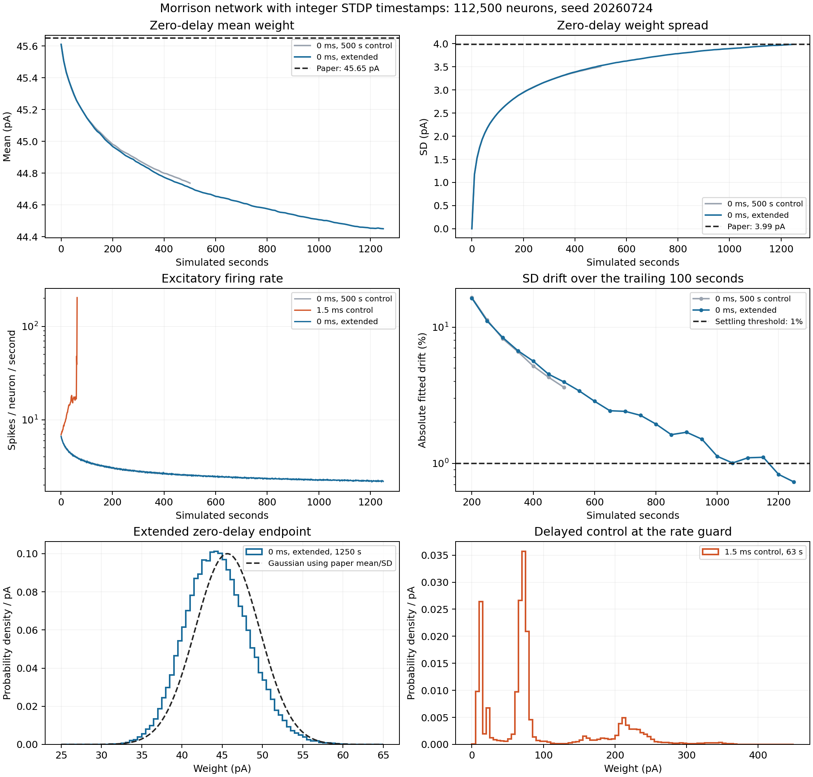

**The zero-delay Morrison experiment is complete.** This report, finalized on
2026-09-24, records the accepted result, workload size, STDP rule, activity and
runtime, and its comparison with the recorded Brunel Morrison baseline. The
final run is H800 job **551753**, which passed the predeclared settling test at
**1,250 simulated seconds**. No further Morrison runs are scheduled as part of
this experiment.

The final sampled E–E weight distribution has mean **44.450353 pA** and
population SD **3.986298 pA**. It is unimodal and approximately bell-shaped.
This establishes a stable workload under the stated finite-window criterion.
The modified delay and the remaining differences in mean weight and firing
rate are part of the final result.

The complete numbers, denominators, ratios and verification record are in
[morrison-final-results-20260924.json](morrison-final-results-20260924.json).

**One timestep means one global 0.1-ms update of the entire network.** The
following table separates the full run, including its initial transient, from
the final 100 seconds used to assess settling. Counts are measured; runtime is
simulation wall time on H800.

| Average per global timestep | Recorded Brunel Morrison | Full Morrison, 0–1,250 s | Full Morrison, 1,150–1,250 s |
|---|---:|---:|---:|
| Excitatory spikes | 5.359700 | 24.041152 | 19.937411 |
| Inhibitory spikes | 1.349200 | 7.995815 | 7.134472 |
| **E + I spikes** | **6.708900** | **32.036967** | **27.071883** |
| E–E presynaptic plastic visits | 2,412.9383 | 216,368.7833 | 179,435.8643 |
| E–E postsynaptic plastic visits | 2,411.8650 | 216,370.3709 | 179,436.6990 |
| **Plastic visits: pre + post** | **4,824.8033** | **432,739.1541** | **358,872.5633** |
| All recurrent presynaptic deliveries | 3,771.8437 | 360,415.9072 | 304,559.9319 |
| All recurrent pre + plastic post visits | 6,183.7087 | 576,786.2780 | 483,996.6309 |
| **Simulation wall time, µs/timestep** | **42.2385** | **249.7867** | **212.5092** |

| Ratio to recorded Brunel Morrison | Full run | Final 100 seconds |
|---|---:|---:|
| E + I spikes per timestep | **4.7753×** | **4.0352×** |
| Plastic pre + post visits per timestep | **89.6905×** | **74.3808×** |
| All recurrent presynaptic deliveries per timestep | 95.5543× | 80.7456× |
| All recurrent pre + plastic post visits per timestep | 93.2751× | 78.2696× |
| Wall time per timestep | **5.9137×** | **5.0312×** |

“Plastic visits” is the primary synapse-update count: one visit to an E–E
synapse's presynaptic or postsynaptic event handler. It includes events with
zero weight change. These are enqueued visits derived from measured spikes
and connectivity, including events pending at a measurement boundary. They
are not counts of distinct modified synapses, nonzero FP32 weight writes, or
all historical pre/post spike pairs represented by a trace.

An E–E presynaptic visit both applies depression and delivers current; it
appears in both the plastic and presynaptic-delivery rows. Consequently,
adding those two rows would double-count it. The last visit-count row counts
every recurrent presynaptic traversal once, plus the E–E postsynaptic visits.
All spike and visit counts exclude the implicit external Poisson drive.

**The finalized network has 112,500 neurons and 1,265,625,000 recurrent
synapses.** It uses fixed indegree, sampled with replacement; recurrent
autapses are excluded and multiple connections are allowed.

| Population or projection | Full Morrison | Recorded Brunel Morrison |
|---|---:|---:|
| Excitatory neurons | 90,000 | 9,000 |
| Inhibitory neurons | 22,500 | 2,250 |
| Excitatory indegree per neuron | 9,000 | 450 |
| Inhibitory indegree per neuron | 2,250 | 112 |
| E→E, plastic | **810,000,000** | **4,050,000** |
| E→I, static | 202,500,000 | 1,012,500 |
| I→E, static | 202,500,000 | 1,008,000 |
| I→I, static | 50,625,000 | 252,000 |
| Total recurrent synapses | **1,265,625,000** | **6,322,500** |

Thus the full workload has 10× as many neurons and 200× as many plastic
synapses. Its measured update ratio is smaller than 200× because its
excitatory firing rate is lower in the reported windows. The total recurrent
synapse ratio is 200.1779× because the Brunel inhibitory indegree rounds to 112.

All recurrent axonal delays and the postsynaptic learning-path delay are
configured as zero. GeNN updates synapses before neurons, so emitted spikes
are consumed on the **following global tick**, an effective 0.1-ms delivery
latency. There are no nonzero configured synaptic latencies in the accepted
case. This scheduling detail is retained in the experiment identity.

The current-based alpha LIF model uses membrane time constant 10 ms,
capacitance 250 pF, refractory period 0.5 ms, threshold 20 mV and reset/rest
0 mV. Initial membrane voltages use mean 5.7 mV and SD 7.2 mV. Both seed and
state seed are 20260724. The initial excitatory synaptic weight is 45.61 pA,
the inhibitory weight is −228.05 pA, and the alpha-current time constant is
0.33 ms. Recurrent delivered currents have scale 1. External excitation is
an independent per-neuron Poisson multiplicity at aggregate rate 20,880 Hz,
sampled in the neuron kernel; there is no explicit external-neuron population
or external synapse matrix. Its expected multiplicity across the network is
234,900 events per global timestep, which is an analytic expectation and is
excluded from the measured recurrent spike totals above.

**The learning rule uses two accumulating traces: all-pairs power-law STDP.**
Each plastic E–E synapse stores a presynaptic trace `x` and a postsynaptic
trace `y`. Both decay exponentially, with time constants 20 ms. In weight
units of pA, the event updates are:

```text
Between events: x *= exp(−elapsed / 20 ms); y *= exp(−elapsed / 20 ms)
Presynaptic event:  w = max(0, w − λ α w y); deliver current; x += 1
Postsynaptic event: w = w + λ w^μ x; y += 1
λ = 0.1, α = 0.1057, μ = 0.4
```

The accumulating traces sum contributions from prior spikes, implementing
all-pairs interactions without enumerating every pair. There is no triplet
`post2` trace, upper weight cap, synaptic normalization or adaptive neuronal
threshold in this workload. Simultaneous new pre/post spikes exclude their
zero-lag pair under the selected causal-boundary convention; older history
still contributes. The code's three timestamp fields are timing bookkeeping,
not three learning traces.

The tuned Brunel Morrison baseline has the same two-trace rule family but
different parameters: depression coefficient 0.1026, depression time constant
30 ms, inhibitory/excitatory ratio 8, alpha-current time constant
0.325827224 ms, delivered-current scale √20, and external rate
12,674.529432 Hz per neuron. Its potentiation exponent and learning coefficient
remain 0.4 and 0.1. The comparison therefore measures the two intended
workloads, rather than an isolated change of network size.

**Settling was tested before declaring completion.** From 200 seconds onward,
the runner checked every 50 seconds over a trailing 100-second window. Two
successive checks had to meet all four limits: absolute fitted SD drift below
1% of mean SD per window, SD range below 2% of mean SD, absolute fitted mean
drift below 0.10 pA per window, and endpoint KS distance below 0.02. Checks at
1,200 and 1,250 seconds passed without relaxing these limits.

In the final window, sampled SD rose from **3.956305 to 3.986298 pA**:
endpoint growth 0.7581%, fitted drift 0.7307%, and range/mean 0.7554%.
The fitted mean drift was −0.01214 pA and endpoint KS distance 0.00477.
This is operational settling over a finite window; residual drift is present.

| Weight statistic | Final zero-delay sample | Paper Figure 4B | Difference |
|---|---:|---:|---:|
| Mean | 44.450353 pA | 45.65 pA | −1.199647 pA (−2.6279%) |
| Population SD | 3.986298 pA | 3.99 pA | −0.003702 pA (−0.0928%) |

The endpoint sample contains 100,000 fixed valid E–E edges, excluding padded
storage. Its range is 29.8607–63.3216 pA, with no zero weights; skewness is
0.2198 and excess kurtosis 0.0966. Mean E/I rates in the final 100 seconds are
2.2153/3.1709 Hz. The paper reports approximately 8.8 Hz, a 1.5-ms propagation
delay, and a histogram averaged over ten samples in the final 500 seconds of
a 2,000-second simulation, using 8.1 million synapses. The similar width
therefore establishes partial agreement in the weight distribution, with a
shifted center and different activity. See
[Morrison, Aertsen and Diesmann (2007), Section 4.1 and Figure 4](https://brainworks.biologie.uni-freiburg.de/2007/journal%20papers/morrison-neco-2007.pdf).

Pooling the eleven snapshots from our final 100 seconds gives mean
44.455899 pA and SD 3.970591 pA. These repeatedly sampled edges are correlated;
the endpoint table does not treat them as independent samples.



The dashed density uses the paper's published Gaussian mean and SD; it is not
digitized paper data. Exportable [PDF](figures/morrison-final-settling.pdf) and
[SVG](figures/morrison-final-settling.svg) copies preserve the existing figure.

**The delay control and timing investigation remain part of the record.**
The final integer-timestamp controls were:

| Job | Configured delay | End time | Outcome | Final weight mean / SD |
|---:|---:|---:|---|---:|
| 551713 | 0 ms | 500 s | Duration cap; failed settling | 44.737274 / 3.505538 pA |
| 551714 | 1.5 ms | 63 s | Population-rate guard | 92.766260 / 77.502081 pA |
| **551753** | **0 ms** | **1,250 s** | **Passed settling; final accepted case** | **44.450353 / 3.986298 pA** |

The extended case started fresh from the same seed and source; sampled weight
files cannot restore the full dynamic state. The delayed control reached
E/I rates 203.767/155.180 Hz in its final second, and did not produce a settled
distribution. Its existing dendritic STDP convention adds a 3-ms postsynaptic
learning path, with effective recurrent delivery 1.6 ms. These controls do not
establish that both delay configurations share an equilibrium distribution,
or that this delayed port reproduces the historical simulator exactly.

Earlier absolute FP32 timestamps could represent the same scheduled event
through two different rounding paths. A discrepancy of one FP32 ulp selected
the wrong simultaneous-event branch, producing an erroneous approximately
0.461-pA increment in deterministic tests. This was a numerical event-identity
defect reproduced on both CPU and CUDA. The intermediate tolerance/gap guard
exposed a longer-time precision limit and was superseded by integer ticks.

The accepted implementation stores timestamps as `uint32`, compares ties
exactly, and converts integer elapsed ticks to FP32 only for trace decay.
Weights, traces and neuron arithmetic remain FP32. Overflow guards stop before
the approximately 4.97-day tick range is exhausted. Each per-synapse timestamp
still occupies four bytes. The retained validation reports 37 passing CPU
tests and 11 passing CUDA timing tests, including same-tick, adjacent-tick,
large-clock and invalid-timestamp cases. The full explanation and generated
kernel evidence remain in the
[integer timing report](MORRISON-INTEGER-TICKS-20260920.md).

**H800 runtime is about 250 µs/timestep over the full run, or 213 µs/timestep
over the final settling window.** The full interval contains 12,500,000
global timesteps and 1.40625 trillion neuron timesteps. Its measured simulation
time was **3,122.334126 s**; total process time was **3,154.735364 s**
(52.58 minutes), including build and diagnostics. Build/initialization took
15.264493 s. Including all recorded process overhead gives 252.3788 µs per
global timestep. The final 100-second window contains 1,000,000 global steps
and consumed **212.509187 s** of simulation wall time.

The simulation timer sums one-second `step` calls, including Python launch
overhead and the final excitatory-counter transfer/synchronization. Other
population transfers, weight sampling, state inspection, compilation and
output are outside that timer. No kernel profiler was enabled. This is one
long scientific run, not a repeated benchmark from a frozen settled state.

The matching historical H800 Brunel result is **42.2385 µs/timestep**, the
median of five 10,000-step timing runs. Their range is 42.0713–42.8443 µs and
their arithmetic mean is 42.4122 µs. Each measures 1,000 simulated ms after
100 ms of presimulation. The ratios above use the published median;
mean-to-mean ratios are preserved in the JSON. Spike and visit counts come
from its separate diagnostic pass, whose population totals match every timed
repetition. Source: the
[per-machine baseline record](../genn-sweep/baseline-20260907-matrix.json)
and [baseline protocol](../BASELINE.md).

That Brunel measurement predates the integer-timestamp fix. It remains a
record of the earlier source; it has not been relabeled as a new measurement.
Different timestamp implementations, activity windows, parameters and timing
protocols limit interpretation of these workload ratios as a pure performance
scaling experiment. In particular, the approximately 75–90× plastic-visit
increase and approximately 5–6× runtime increase do not measure an isolated
synapse-kernel speedup.

The final run used an allocated H800 80-GB-class GPU on node `g40`, eight CPU
cores and 120 GB requested host RAM, with single-thread OpenMP/OpenBLAS.
Its initial GPU process allocation was **28,642 MiB**; this is an allocation
snapshot, not a measured peak. The runner used the pinned GeNN environment,
CUDA 12.8.1, GCC 12.4 and Python 3.12.4. The accepted endpoint and runtime are
H800 measurements. Earlier 10-second A800/H800 feasibility pilots predated the
integer fix and sampled a more active transient; their 742.45/462.25-µs
timings remain in [PILOTS.md](PILOTS.md) and are not settled-state timings.

**Provenance and closure checks are retained.** The final run's source base
was Git `9ad791ebc67086cb28047b82a884bceb55a565d3` plus its archived worktree.
It executed from an immutable copied source directory, so its own Git query
returned “not a git repository”; source hashes provide the direct identity.
At finalization, the live `brunel/ports/common.py`, `brunel/ports/genn_port.py`
and `workloads/morrison.py` still matched the recorded hashes. The current
documentation-time Git revision is recorded separately in the final JSON.

The closure check rehashed **all 238 downloaded files** against the retained
remote SHA-256 manifests, checked all 1,250 one-second activity intervals,
recomputed final visits by dotting per-neuron spike counts with actual
outdegrees, recalculated moments of all 126 weight samples, and independently
recomputed both passing settling windows. All checks passed. No simulator code
was changed, and no additional simulations were needed.

The complete run is retained under
`copilot/tmp/workload_integer_ticks_20260920/integer_settling_morrison_0p0_551753/`.
Important artifacts are:

- [Run manifest](../copilot/tmp/workload_integer_ticks_20260920/integer_settling_morrison_0p0_551753/manifest.json), [result](../copilot/tmp/workload_integer_ticks_20260920/integer_settling_morrison_0p0_551753/result.json), [per-second activity](../copilot/tmp/workload_integer_ticks_20260920/integer_settling_morrison_0p0_551753/activity.jsonl), and [settling checks](../copilot/tmp/workload_integer_ticks_20260920/integer_settling_morrison_0p0_551753/settling_checks.jsonl).
- [Final weight sample](../copilot/tmp/workload_integer_ticks_20260920/integer_settling_morrison_0p0_551753/weights_1250.npz), [sample locations and outdegrees](../copilot/tmp/workload_integer_ticks_20260920/integer_settling_morrison_0p0_551753/sample_identity.npz), and [per-neuron spike counts](../copilot/tmp/workload_integer_ticks_20260920/integer_settling_morrison_0p0_551753/final_population_counts.npz).
- [Exact executed Python command](../copilot/tmp/workload_integer_ticks_20260920/integer_settling_morrison_0p0_551753/command.txt), [complete batch command and environment](../copilot/tmp/workload_integer_ticks_20260920/morrison_settling_batch_command.txt), [submission and resource request](../copilot/tmp/workload_integer_ticks_20260920/settling_submission_0.0.json), and [successful Slurm completion](../copilot/tmp/workload_integer_ticks_20260920/slurm_settling_job.txt).
- [Initial-control hash manifest](../copilot/tmp/workload_integer_ticks_20260920/remote_sha256_initial.json), [extended-run hash manifest](../copilot/tmp/workload_integer_ticks_20260920/remote_sha256_settling.json), and [all three integer-control summaries](integer-timestamps-results-20260920.json).

Historical stages remain available in the [initial delay/count investigation](INVESTIGATION-20260920.md),
[pre-fix settling investigation](SETTLING-HOMEOSTASIS-20260920.md),
[intermediate tolerance/guard report](MORRISON-TICK-TOLERANCE-20260920.md),
and [integer-timestamp report](MORRISON-INTEGER-TICKS-20260920.md). Their
different source versions, transient windows and failed controls retain their
original labels.
